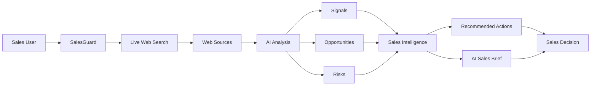

# SalesGuard
> Real-time sales intelligence before every call.

## Current Progress (Updated on 25th August 2026)

1. Domain/logo/LinkedIn matching accuracy — fixed. Strict domain validation,
   consensus-based domain picking, subdomain collapsing for logos, and a
   known-abbreviation override table (ti.com, ge.com, ibm.com, etc.) so the
   right official site/logo/LinkedIn page shows up instead of a wrong or
   unrelated one. ✔ (done)
2. Company-named-after-domain bug fixed — companies like "linkup.so" or
   "cal.com" now match correctly against their own domain instead of
   silently failing validation. ✔ (done)
3. Risk scoring rebuilt — term-frequency counting with diminishing returns
   (log-scaled) and a smooth logistic-bounded score (5–95) instead of the
   old boolean/density-based math that could swing wildly on short result
   sets. ✔ (done)
4. Search quality — dropped known low-quality/templated content-farm
   domains from the scoring corpus, prioritized reputable sources, capped
   results-per-domain so one wire service can't crowd out everything else,
   and rewrote the search query to reduce risk-flavored SEO bait. ✔ (done)
5. Verified Source badges — each result now shows whether it's from a
   recognized outlet (major news, financial press, AI/tech industry press,
   or an official/government source) or the company's own confirmed
   website — vs. an unverified/unknown source. Helps a rep judge how much
   to trust what they're reading at a glance. ✔ (done)

## Known Limitations

- LinkedIn slug matching is exact-match only, so it's still not fully
  reliable for small/niche companies without a well-known page.
- Risk scoring is keyword-based and can't yet distinguish "this happened
  to the company" from "the company is reporting on this industry-wide"
  (e.g. a company's own published Data Breach Cost Report shouldn't
  inflate its own score). Flagged as a v2 item — needs LLM-assisted
  relevance judgment, not a math fix.
- Verified-source list is a manually maintained allowlist; it'll miss
  legitimate niche/regional outlets not yet added.  

## Problem

Sales reps waste 30-45 minutes researching companies before calls.
SalesGuard does it in 30 seconds.

## Solution

Type a company name. SalesGuard fetches live news via Linkup deep search,
scores risk using a custom algorithm, and generates personalized outreach
strategies using Groq's LLM.

## How It Works



## How Linkup Is Used

Linkup powers two searches per query:
1. Deep search for company news, financials, and risk signals
2. Standard search to find the official LinkedIn company page

## Features

- Real-time risk scoring (5-95) from live news
- AI-generated executive summary
- 6-9 personalized outreach suggestions
- Official company links (website + LinkedIn)
- AI sales assistant chatbot (company-specific)
- PDF export
- Copy suggestions to clipboard

## Tech Stack

Backend: FastAPI + LangGraph + LangChain, Linkup API for web search, Groq (openai/gpt-oss-120b) for analysis
Frontend: React + Vite
Deployment: Render (backend), Vercel (frontend)

## Run Locally

Follow these steps to set up and run the application on your machine. You will need two separate terminal windows.

## 1. Backend Setup
Navigate to the backend directory, install the required Python packages, and launch the FastAPI server:

```bash
cd backend
pip install -r requirements.txt
uvicorn main:app --port 8001 --reload
```

## 2. Frontend Setup
Open a new terminal window, navigate to the frontend directory, install the Node dependencies, and start the React development server: 

```bash
cd frontend
npm install
npm run dev
```

## Environment Variables

Create a `.env` file in the following directories:

**Backend (`/backend/.env`)**

| Variable | Description |
| :--- | :--- |
| `LINKUP_API_KEY` | Your API key from Linkup |
| `GROQ_API_KEY` | Your API key from Groq |

**Frontend (`/frontend/.env`)**

| Variable | Description |
| :--- | :--- |
| `VITE_API_URL` | The backend URL (e.g., `http://localhost:8001`) |

## Live Demo

https://salesguard.vercel.app/

## Built By

Arya — Team "Back-Spaced - solo developer — Linkup Async Hackathon 2026

